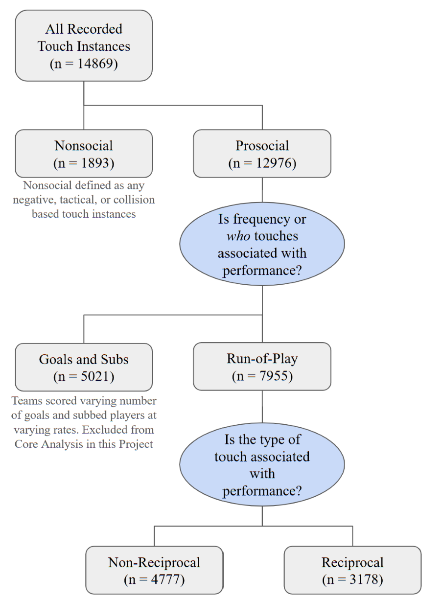

```{r setup, include=FALSE}
knitr::opts_chunk$set(echo = TRUE)
```

## Phase One: Initial Data Analysis and Exploration 

Note: One limitation of this dataset is that most variables are not continuous. For example, final rank is ordinal (a team cannot finish 3.5th), and goal differential is an integer. This restricts the use of certain statistical models. We will address this further in Phase Two using an ordinal mixed-effects model framework.

Data Management, merging, and cleaning not shown. 
```{r Data Management, message=FALSE, warning=FALSE, include=FALSE}
# Data_Management
# For more information on these data frames please look at the README.md file

library(tidyverse)
library(data.table)
library(broom)
library(janitor)
library(readxl)
library(rmarkdown)
library(readr)
library(ggrepel)


################################################################

# raters and corresponding sheets
# Rater1 = Paige, Rater2 = Tobi, Rater3 = Simon

raters <- list(
  Rater1 = list(touch = "Touch_Paige.csv", match = "Match_Paige.csv"),
  Rater2 = list(touch = "Touch_Tobi.csv",  match = "Match_Tobi.csv"),
  Rater3 = list(touch = "Touch_Simon.csv", match = "Match_Simon.csv")  
)

Touch_Dataframes_List <- map2(names(raters), raters, function(rater_name, files) {
  read_csv(file.path("SpreadSheets", files$touch)) %>%
    slice(-1) %>%  # remove instruction row
    mutate(across(where(is.character), ~ str_replace_all(., '^"|"$', ""))) %>%
    mutate(Rater = rater_name)
})

Touches <- bind_rows(Touch_Dataframes_List)

Match_Dataframes_List <- map2(names(raters), raters, function(rater_name, files) {
  read_csv(file.path("SpreadSheets", files$match)) %>%
    slice(-1) %>%  # removes instruction row (row 2 from the sheet)
    mutate(across(where(is.character), ~ str_replace_all(., '^"|"$', ""))) %>%
    mutate(Rater = rater_name)
})

Matches <- bind_rows(Match_Dataframes_List)


############################ Additional Data for Comparing ############################ 

#Primary_SeasonOverview <- read_csv("SpreadSheets/Primary_SeasonOverview.csv")

Team_IDs <- read_csv("SpreadSheets/TeamIDs.csv")

#Stadiums <- read_csv("SpreadSheets/Stadiums.csv")

#MatchAssignments_WatchOrder <- read_csv("SpreadSheets/MatchAssignments_WatchOrder.csv")

StandingsByWeek <- read_csv("SpreadSheets/StandingsByWeek_Clean.csv")

FinalStandings <- read_csv("SpreadSheets/FinalSeasonStandings.csv")

############################ Defining Valid Entries ############################ 

#Defining valid entries into columns based on project setup

# Define valid values

valid_touch_actions <- c(
  "Tap", "Bump", "Push", "Squeeze", "Grab",
  "Kiss", "Hug", "Rub", "Stroke"
)

valid_reciprocal <- c("N", "Y", "G")

valid_body_parts <- c(
  "H", "Arm", "FT", "Legs", "BT", "Gluteal Region", 
  "Head", "Neck", "Feet"
)

valid_situations <- c(
  "F", "FY", "FR", "KS", "SA", "PP", "SUB", "GF", "GA", "DA",
  "CK", "TI", "REF", "IT", "HB", "OFF", "GK", "HUD", "WALL",
  "PEN", "Other", "BRAWL"
)

valid_hapticrituals <- c(
  "HF1", "HF2", "LF1", "LF2", "CO", "HS", "HT", "P", "CB",
  "GHUG", "FB", "HR", "HH", "CR", "DP", "BS", "HUP", "CAP",
  "SG", "NEG", "Other", "FBP", "BBP", "HUG", "CHUG", "TA", "SHUG"
)

############################ Cleaning Data | Obvious Human Error ############################ 

#Cleaning Functions to fix user input error: Such as "Arn" to "Arm"

clean_touch_action <- function(x) {
  case_when(
    x %in% c("GHUG", "HUG") ~ "Hug",
    TRUE ~ x
  )
}

clean_reciprocal <- function(x) {
  case_when(
    x == "B" ~ "N",
    TRUE ~ x
  )
}

clean_body_parts <- function(x) {
  x %>%
    as.character() %>%
    str_remove_all('^\"|\"$') %>%           # remove any surrounding quotes
    str_split(",\\s*") %>%
    map_chr(~ paste(
      str_trim(str_replace_all(.x, c(
        "Arn" = "Arm",
        "AH" = "Arm",
        "Hand" = "H",
        "Foot" = "Feet",
        "Back Torso" = "BT",
        "Front Torso" = "FT",
        "\\bLeg\\b" = "Legs",
        "Bt" = "BT",
        "Ft" = "FT"
      ))),
      collapse = ", "
    ))
}

clean_situation <- function(x) {
  case_when(
    x == "FEF" ~ "REF",
    x == "HK" ~ "GK",
    x == "PK" ~ "PEN",
    x == "Ref" ~ "REF",
    TRUE ~ x
  )
}

clean_haptic_ritual <- function(x) {
  x %>%
    as.character() %>%
    str_remove_all('^\"|\"$') %>%
    str_split(",\\s*") %>%
    map_chr(~ paste(
      str_trim(str_replace_all(.x, c(
        "LF!" = "LF1"
      ))),
      collapse = ", "
    ))
}

clean_visibility <- function(x) {
  case_when(
    x %in% c("B", "H") ~ "G",
    TRUE ~ x
  )
}


#Now applying these functions to corresponding data frames and columns

Touches <- Touches %>%
  mutate(
    TouchAction = clean_touch_action(TouchAction),
    ToucherBodyPart = clean_body_parts(ToucherBodyPart),
    ToucheeBodyPart = clean_body_parts(ToucheeBodyPart),
    Situation = clean_situation(Situation),
    HapticRitual = clean_haptic_ritual(HapticRitual),
    Reciprocal = clean_reciprocal(Reciprocal),
    Visibility = clean_visibility(Visibility)
  )

############################ Functions to check for invalid entries in data frame ############################ 

#First fxns for checking columns that had lists (read in strangely so needed extra love)

is_invalid_bodypart <- function(x) { #splits lists within cell to look at individual values (checks to make sure "FT, Arn" is flagged for "Arn")
  x %>%
    as.character() %>%                    # ensures all input is character
    str_split(",\\s*") %>%
    map_lgl(~ {
      parts <- .x
      if (any(is.na(parts)) || any(parts == "NA")) return(TRUE)  # flag both empty and NA values
      any(!parts %in% valid_body_parts)     # TRUE only if any part is invalid
    })
}

is_invalid_haptic_ritual <- function(x) { #splits lists within cell to look at individual values (flags things like "CR, BF" for "BF" which is not a valid haptic ritual)
  x %>%
    as.character() %>%
    str_split(",\\s*") %>%
    map_lgl(~ {
      parts <- .x
      if (any(is.na(parts)) || any(parts == "NA")) return(TRUE)
      any(!parts %in% valid_hapticrituals)
    })
}

#Function to let us know where the invalid feature occurs. Output is a new column that contains the column location of the error
get_invalid_fields <- function(row) {
  invalid_fields <- c()
  
  if (!(row$Reciprocal %in% valid_reciprocal)) {
    invalid_fields <- c(invalid_fields, "Reciprocal")
  }
  
  if (is_invalid_bodypart(row$ToucherBodyPart)) {
    invalid_fields <- c(invalid_fields, "ToucherBodyPart")
  }
  
  if (is_invalid_bodypart(row$ToucheeBodyPart)) {
    invalid_fields <- c(invalid_fields, "ToucheeBodyPart")
  }
  
  if (!(row$Situation %in% valid_situations)) {
    invalid_fields <- c(invalid_fields, "Situation")
  }
  
  if (is_invalid_haptic_ritual(row$HapticRitual)) {
    invalid_fields <- c(invalid_fields, "HapticRitual")
  }
  
  if (!(row$TouchAction %in% valid_touch_actions)) {
    invalid_fields <- c(invalid_fields, "TouchAction")
  }
  
  paste(invalid_fields, collapse = ", ")
}
############################ Trouble-Shooting | Human Input Error ############################ 

#Troubleshooting: Looking at each column and checking values to look for human error while inputting data during collection

cols <- c("Team", "TouchAction", "Reciprocal", "ToucherBodyPart", "ToucheeBodyPart", "Situation", "HapticRitual", "Visibility")

#Starting with Touches

unique_vals <- Touches %>%
  select(all_of(cols)) %>% 
  map(~ unique(.))

max_len <- max(lengths(unique_vals))
padded <- map(unique_vals, ~ { length(.) <- max_len; . })
unique_values_df <- as.data.frame(padded)

#determining which touchID and rater discrepancies are connected to
#"Show me the mistakes, so I can fix them or track who made them":

Touches_invalid <- Touches %>%
  filter(
    !(Reciprocal %in% valid_reciprocal) |
      is_invalid_bodypart(ToucherBodyPart) |
      is_invalid_bodypart(ToucheeBodyPart) |
      !(Situation %in% valid_situations) |
      is_invalid_haptic_ritual(HapticRitual) |
      !(TouchAction %in% valid_touch_actions)
  )

Touches_invalid_by_rater <- split(Touches_invalid, Touches_invalid$Rater) #split by rater

Touches_invalid_labeled <- map(Touches_invalid_by_rater, function(df) { #apply get_invalid_fields() to each row in each rater's dataframe
  df %>%
    rowwise() %>%
    mutate(Invalid_Fields = get_invalid_fields(pick(everything()))) %>%
    ungroup()
})

Touches_invalid_rater1 <- Touches_invalid_labeled[["Rater1"]]
Touches_invalid_rater2 <- Touches_invalid_labeled[["Rater2"]]
Touches_invalid_rater3 <- Touches_invalid_labeled[["Rater3"]]

############################ Final Data Frame Creation | Separation of Inter-rater Game Data ############################ 

#Creating the final data frames used for analysis
#Removes the data from matches not assigned to that specific rater. For example, if Rater 1 was assigned match 126, 
#then Rater 2 and 3 also watched it and have populated data for that match.
#this section removes that data created from rater 2 and 3 keeping only rater 1s info.
#Do this to both the Matches and Touches Dataframs (has to happen twice)

#Define match assignments
InterRaterMatches_Rater1 <- c("127", "115", "26", "87") #Paige
InterRaterMatches_Rater2 <- c("114", "39", "163", "42") #Tobi
InterRaterMatches_Rater3 <- c("95", "150", "38", "160") #Simon

#Combine all 12 interrater matches with rater mapping
interrater_assignments <- tibble(
  SeasonMatchNumber = c(InterRaterMatches_Rater1, InterRaterMatches_Rater2, InterRaterMatches_Rater3),
  AssignedRater = c(rep("Rater1", length(InterRaterMatches_Rater1)),
                    rep("Rater2", length(InterRaterMatches_Rater2)),
                    rep("Rater3", length(InterRaterMatches_Rater3)))
)

#SeasonMatchNumber imported differently, need to change to same character thingy
interrater_assignments <- interrater_assignments %>%
  mutate(SeasonMatchNumber = as.character(SeasonMatchNumber))

Touches <- Touches %>%
  mutate(SeasonMatchNumber = str_remove(as.character(SeasonMatchNumber), "^0+")) #removes leading zeros

Matches <- Matches %>%
  mutate(SeasonMatchNumber = str_remove(as.character(SeasonMatchNumber), "^0+")) #removes leading zeros

#make new data frame from Touches, if row contains InterRaterMatches_Rater1 and the word rater 1, keep it, otherwise delete row

Touches_final <- Touches %>% #This df has all matches, but excludes the repeated matches watched for inter-rater study except by the rater they were originally assigned for
  anti_join(interrater_assignments, by = c("SeasonMatchNumber" = "SeasonMatchNumber")) %>%
  bind_rows(
    Touches %>%
      inner_join(interrater_assignments, by = c("SeasonMatchNumber")) %>%
      filter(Rater == AssignedRater)
  )

#Same as above but for matches now (performance data for each match)
Matches_final <- Matches %>%
  anti_join(interrater_assignments, by = c("SeasonMatchNumber" = "SeasonMatchNumber")) %>%
  bind_rows(
    Matches %>%
      inner_join(interrater_assignments, by = c("SeasonMatchNumber")) %>%
      filter(Rater == AssignedRater)
  )


############################ Inter-rater Game Data ############################ 

#Creation of data frames for Inter-rater data analysis
#Simply looks at all matches that were watched by multiple people

Touches_interrater <- Touches %>%
  inner_join(interrater_assignments, by = "SeasonMatchNumber")

Matches_interrater <- Matches %>%
  inner_join(interrater_assignments, by = "SeasonMatchNumber")


```

```{r Matches_Performance, message=FALSE, warning=FALSE, include=FALSE}
#Cleaning up and Extracting Info from the Match_Performance Sheet
#Goal to get:
#Minutes Played for each player
#Minutes played by each team
#Penalty Kick Info

library(tidyverse)
library(data.table)
library(broom)
library(janitor)
library(readxl)
library(rmarkdown)
library(readr)
library (dplyr)
library(plotly)
library(mgcv)
library(ggplot2)
library(forcats)
library(ggridges)
library(DescTools)
library(tidyr)
library(purrr)

############################ Overall Team Data ############################
#Info Team by Team
Matches_ID <- Matches_final %>%
  mutate(
    MatchID = str_pad(MatchID, width = 4, pad = "0"),  # in case it was shortened
    TeamID = str_sub(MatchID, 1, 2),
    Substitutes = as.character(Substitutes),
    Substitutes = str_replace_all(Substitutes, "\\.", ",")
  )

team_minutesplayed <- Matches_ID %>% 
  mutate(
    MatchLength = as.numeric(MatchLength)  # Convert to numeric
  ) %>%
  group_by(TeamID) %>%
    summarise(
      TotalMinutesPlayed = sum(MatchLength, na.rm = TRUE),
      MatchCount = n()
    ) %>%
    arrange(desc(TotalMinutesPlayed))

#Formations teams played
formation_counts <- Matches_ID %>%
  group_by(TeamID, Formation) %>%
  summarise(FormationCount = n(), .groups = "drop") %>%
  pivot_wider(
    names_from = Formation,
    values_from = FormationCount,
    values_fill = 0  # Fill in 0 if a team never used a certain formation
  )

############################ Overall League Data ############################

#Most Popular Formations
popular_formations <- Matches_ID %>%
  group_by(Formation) %>%
  summarise(TimesUsed = n(), .groups = "drop") %>%
  arrange(desc(TimesUsed))

############################ Player Data ############################

#Determine how many minutes each player played

#First determine the starters across the season for each team
starter_players <- Matches_ID %>%
  mutate(StarterList = str_split(Starters, ",\\s*")) %>%   # split by comma, trim spaces
  rowwise() %>%
  mutate(
    StarterCount = length(StarterList),
    StarterFlag = ifelse(StarterCount != 11, TRUE, FALSE)  # flag if not 11
  ) %>%
  ungroup() %>%
  select(TeamID, StarterList, StarterFlag, SeasonMatchNumber, FirstHalfLength, SecondHalfLength) %>%
  unnest(StarterList) %>%
  mutate(StarterList = str_trim(StarterList))  # clean whitespace

unique_team_players <- starter_players %>%
  mutate(StarterList = str_trim(StarterList)) %>%
  distinct(TeamID, StarterList) %>%
  rename(Player = StarterList)

flagged_starter_matches <- Matches_ID %>%
  mutate(
    StarterList = str_split(Starters, ",\\s*"),
    StarterCount = lengths(StarterList)
  ) %>%
  filter(StarterCount != 11) %>%
  select(SeasonMatchNumber, FirstHalfLength, SecondHalfLength, TeamID, StarterCount, Starters)

#Determine the Subs and add them to the starters
subs_exploded <- Matches_ID %>%
  select(SeasonMatchNumber, FirstHalfLength, SecondHalfLength, TeamID, Substitutes) %>%
  filter(!is.na(Substitutes) & Substitutes != "") %>%
  mutate(Substitutes = as.character(Substitutes)) %>% 
  mutate(
    Substitutes = str_split(Substitutes, ",\\s*")) %>%
  unnest(Substitutes)

#Parse the substitution strings into their parts
subs_parsed_noRedCards <- subs_exploded %>%
  filter(str_detect(Substitutes, "^\\d{8}$")) %>%  # Keep only well-formed subs
  mutate(
    SubIn   = str_sub(Substitutes, 1, 2),
    SubOut  = str_sub(Substitutes, 3, 4),
    Half    = str_sub(Substitutes, 5, 5),
    Minute  = as.numeric(str_sub(Substitutes, 6, 8))
  ) %>%
  select(SeasonMatchNumber, FirstHalfLength, SecondHalfLength, TeamID, Substitutes, SubIn, SubOut, Half, Minute)

# Parse red card "subs"
red_cards_parsed <- subs_exploded %>%
  filter(str_detect(Substitutes, "^FR\\d{6}$")) %>%
  mutate(
    SubIn   = NA_character_,  # no one comes in because of Red Card
    SubOut  = str_sub(Substitutes, 3, 4),  # player sent off
    Half    = str_sub(Substitutes, 5, 5),
    Minute  = as.numeric(str_sub(Substitutes, 6, 8))
  ) %>%
  select(SeasonMatchNumber, FirstHalfLength, SecondHalfLength, TeamID, Substitutes, SubIn, SubOut, Half, Minute)

subs_parsed <- bind_rows(subs_parsed_noRedCards, red_cards_parsed) #combines together acceptable values

#Sub issues to flag
sub_issues <- Matches_ID %>%
  mutate(SeasonMatchNumber = as.character(SeasonMatchNumber)) %>%
  separate_rows(Substitutes, sep = ",\\s*") %>%
  filter(Substitutes != "") %>%
  mutate(Flag = !str_detect(Substitutes, "^\\d{8}$") & !str_detect(Substitutes, "^FR\\d{6}$")) %>% #selects subs with 8 digits and those with improper FR setup
  filter(Flag) %>%
  select(SeasonMatchNumber, Substitutes)

# Now filter out bad sub entries (those not 8 digits or not FR + 6 digits)
subs_parsed_clean <- subs_parsed %>%
  anti_join(sub_issues, by = c("SeasonMatchNumber", "Substitutes"))

# Get all distinct subbed-in players per team
subbed_in_players <- subs_parsed_clean %>%
  select(TeamID, SubIn) %>%
  distinct() %>%
  rename(Player = SubIn)

unique_sub_players <- subs_parsed_clean %>%
  mutate(SubIn = str_trim(SubIn)) %>%                 # <- trim here too
  distinct(TeamID, SubIn) %>%
  rename(Player = SubIn)

# Combine starters and subbed-in players
all_unique_team_players <- bind_rows(unique_team_players, unique_sub_players) %>%
  mutate(
    Player = str_trim(Player),
    PlayerCharLength = nchar(Player)
  ) %>%
  distinct(TeamID, Player, PlayerCharLength)

#Give a complete list of each jersey number that shows up for a team
# Group players by team and nest them into a list column
team_player_lists <- all_unique_team_players %>%
  mutate(Player = as.character(str_trim(Player))) %>%  # Clean and ensure characters
  group_by(TeamID) %>%
  summarise(
    PlayerList = paste(sort(unique(Player)), collapse = ", "),
    .groups = "drop"
  )

#Now Let's figure out minutes played for starters who were not subbed out in a match

# From starter_players: select and rename StarterList to Player
starter_players_long <- starter_players %>%
  select(SeasonMatchNumber, TeamID, StarterList) %>%
  rename(Player = StarterList)

# From subs_parsed_clean: select and rename SubIn to Player
subins_long <- subs_parsed_clean %>%
  select(SeasonMatchNumber, TeamID, SubIn) %>%
  rename(Player = SubIn)

# Combine both into one dataframe, keep distinct values
match_player_entries <- bind_rows(starter_players_long, subins_long) %>%
  mutate(Player = str_trim(as.character(Player))) %>%
  distinct(SeasonMatchNumber, TeamID, Player, .keep_all = TRUE)

#pure iteration row by row (inefficient) to see fi player was subbed in/out
match_player_entries <- match_player_entries %>% 
  mutate(
    WasPlayerSubbedIn = pmap_chr(
      list(SeasonMatchNumber, TeamID, Player),
      ~ if_else(
        any(subs_parsed_clean$SeasonMatchNumber == ..1 &
              subs_parsed_clean$TeamID == ..2 &
              subs_parsed_clean$SubIn == ..3),
        "Y", "N"
      )
    )
  )

match_player_entries <- match_player_entries %>%
  mutate(
    WasPlayerSubbedOut = pmap_chr(
      list(SeasonMatchNumber, TeamID, Player),
      ~ if_else(
        any(subs_parsed_clean$SeasonMatchNumber == ..1 &
              subs_parsed_clean$TeamID == ..2 &
              subs_parsed_clean$SubOut == ..3),
        "Y", "N"
      )
    )
  )

Matches_ID_unique <- Matches_ID %>%
  mutate(SeasonMatchNumber = as.character(SeasonMatchNumber)) %>%
  select(SeasonMatchNumber, TeamID, FirstHalfLength, SecondHalfLength) %>%
  distinct()

Matches_ID_unique %>%
  count(SeasonMatchNumber, TeamID) %>%
  filter(n > 1)  # should not happen

Matches_ID_unique <- Matches_ID_unique %>% distinct(SeasonMatchNumber, TeamID, .keep_all = TRUE)

# Now join safely by both SeasonMatchNumber and TeamID
match_player_entries <- match_player_entries %>%
  mutate(SeasonMatchNumber = as.character(SeasonMatchNumber)) %>%
  left_join(Matches_ID_unique, by = c("SeasonMatchNumber", "TeamID"))

# First, extract only relevant sub-in/out info
sub_in_info <- subs_parsed_clean %>%
  filter(!is.na(SubIn)) %>%  # red cards won't have SubIn
  select(SeasonMatchNumber, TeamID, Player = SubIn, SubbedInHalf = Half, SubbedInMinute = Minute)
  
sub_out_info <- subs_parsed_clean %>%
  select(SeasonMatchNumber, TeamID, Player = SubOut, SubbedOutHalf = Half, SubbedOutMinute = Minute)
  
sub_in_info %>%
  count(SeasonMatchNumber, TeamID, Player) %>%
  filter(n > 1)  # should all be 1

sub_out_info %>%
  count(SeasonMatchNumber, TeamID, Player) %>%
  filter(n > 1)  # same

# Now, join it to match_player_metrics for only those who were subbed in/out
match_player_entries <- match_player_entries %>%
  left_join(sub_in_info, by = c("SeasonMatchNumber", "TeamID", "Player"))

match_player_entries <- match_player_entries %>%
  left_join(sub_out_info, by = c("SeasonMatchNumber", "TeamID", "Player"))

match_player_entries <- match_player_entries %>%
  mutate(
    Player = str_trim(as.character(Player)),
    TeamID = str_trim(as.character(TeamID)),
    SeasonMatchNumber = str_trim(as.character(SeasonMatchNumber))
  )

#create a function to turn everything into seconds
convert_mmss_to_seconds <- function(mmss) {
  mm <- floor(mmss / 100)
  ss <- mmss %% 100
  mm * 60 + ss
}

#Convert everything to numeric
match_player_entries <- match_player_entries %>%
  mutate(
    FirstHalfLength = as.numeric(FirstHalfLength),
    SecondHalfLength = as.numeric(SecondHalfLength),
    SubbedInMinute = as.numeric(SubbedInMinute),
    SubbedOutMinute = as.numeric(SubbedOutMinute)
  )

# Apply to your data frame
match_player_entries <- match_player_entries %>%
  mutate(
    FirstHalfSeconds = convert_mmss_to_seconds(FirstHalfLength),
    SecondHalfSeconds = convert_mmss_to_seconds(SecondHalfLength)
  )

#Let's do math to figure out how many seconds each player played
match_player_entries <- match_player_entries %>%
  mutate(
    SubInOutConflict = if_else(
      WasPlayerSubbedIn == "Y" & WasPlayerSubbedOut == "Y",
      TRUE, FALSE
    )
  ) %>% 
  mutate(
    MatchSecondsPlayed = case_when(
      # Not subbed in and not subbed out → full match
      WasPlayerSubbedIn == "N" & WasPlayerSubbedOut == "N" ~ (FirstHalfSeconds + SecondHalfSeconds),
      
      # Not subbed in and subbed out in 1st half
      WasPlayerSubbedIn == "N" & WasPlayerSubbedOut == "Y" & SubbedOutHalf == "1" ~
        if_else(SubbedOutMinute == 46, FirstHalfSeconds, (SubbedOutMinute * 60)),
      
      # Not subbed in and subbed out in 2nd half
      WasPlayerSubbedIn == "N" & WasPlayerSubbedOut == "Y" & SubbedOutHalf == "2" ~
        if_else(SubbedOutMinute == 46,
                FirstHalfSeconds,
                (FirstHalfSeconds + ((SubbedOutMinute - 45)*60))),
      
      # Subbed in and subbed in 1st half
      WasPlayerSubbedIn == "Y" & WasPlayerSubbedOut == "N" & SubbedInHalf == "1" ~
        if_else(SubbedInMinute == 46, convert_mmss_to_seconds(SecondHalfLength), 
                (SecondHalfSeconds + (FirstHalfSeconds - (SubbedInMinute*60)))),
      
      # Subbed in and subbed in 2nd half
      WasPlayerSubbedIn == "Y" & WasPlayerSubbedOut == "N" & SubbedInHalf == "2" ~
        if_else(SubbedInMinute == 46, SecondHalfSeconds, 
                (SecondHalfSeconds - ((SubbedInMinute - 45)*60))),
      
      # Subbed in AND subbed out
      WasPlayerSubbedIn == "Y" & WasPlayerSubbedOut == "Y" ~
        case_when(
          SubbedInMinute == 46 ~ (SubbedOutMinute - 45) * 60,
          
          SubbedInHalf == "1" & SubbedOutHalf == "1" ~ 
            (SubbedOutMinute - SubbedInMinute) * 60,
          
          SubbedInHalf == "1" & SubbedOutHalf == "2" ~ 
            (FirstHalfSeconds - SubbedInMinute * 60) + (SubbedOutMinute - 45) * 60,
          
          SubbedInHalf == "2" & SubbedOutHalf == "2" ~ 
            (SubbedOutMinute - SubbedInMinute) * 60,
          
          TRUE ~ NA_real_
        ),
      
      # Fallback
      TRUE ~ NA_real_
    )
  )

#Add a column with Rater so we know who is having errors
match_player_entries <- match_player_entries %>%
  left_join(
    Matches_final %>%
      select(SeasonMatchNumber, Rater) %>%
      distinct(),  # <-- ensures only one row per SeasonMatchNumber-Rater pair
    by = "SeasonMatchNumber"
  )

match_player_entries <- match_player_entries %>%
  mutate(
    SubInTime = case_when(
      WasPlayerSubbedIn == "N" ~ 0,
      WasPlayerSubbedIn == "Y" & SubbedInHalf == "1" ~ SubbedInMinute * 60,
      WasPlayerSubbedIn == "Y" & SubbedInHalf == "2" ~ (FirstHalfSeconds + ((SubbedInMinute - 45) * 60)),
      TRUE ~ NA_real_
    )
  )

#Now I have seconds played. Add that up for each player over the season.
player_season_totals <- match_player_entries %>%
  group_by(TeamID, Player) %>%
  summarise(
    TotalSecondsPlayed = sum(MatchSecondsPlayed, na.rm = TRUE),
    .groups = "drop"
  ) %>%
  arrange(desc(TotalSecondsPlayed))


duplicates <- match_player_entries %>%
  group_by(SeasonMatchNumber, TeamID, Player) %>%
  filter(n() > 1) %>%
  arrange(SeasonMatchNumber, TeamID, Player)


checker <- match_player_entries %>%
  count(SeasonMatchNumber, TeamID, Player) %>%
  filter(n > 1) %>%
  arrange(desc(n))

```


## Overview Summary and Touch Data Filtering

In this section, we summarize the raw touch dataset and walk through the filtering process that created the dataset used for hypothesis testing. 
This includes defining what counts as a prosocial touch, removing non-gameflow situations like goals and substitutions, and labeling touches as reciprocal or nonreciprocal.

```{r Overview_Summary, echo=TRUE, message=FALSE, warning=FALSE}
# Data Summary and Overview
# Gives Simple overall counts, tables, data make-up etc

library(tidyverse)
library(data.table)
library(broom)
library(janitor)
library(readxl)
library(rmarkdown)
library(readr)
library (dplyr)
library(knitr)
library(ggridges)
library(tibble)

############################ Complete data summary | No filtering ############################ 

#Create Tables that summarizes complete data of "Touches_final" and "Matches_final"

Touches_Summary <- Touches_final
Matches_Summary <- Matches_final

Total_Touch_Instance_count <- nrow(Touches_Summary) #count total number of touches recorded

Total_Match_Count <- n_distinct(Touches_Summary$SeasonMatchNumber) #total number of matches watched

Total_Teams <- n_distinct(Touches_Summary$Team) #teams recorded

Total_Matches_perTeam <- 26 #Matches each team played (verified below)

Summary_Table_A <- tibble(
  Variable = c("Total_Touch_Instance_count", "Total_Match_Count", "Total_Teams", "Total_Matches_perTeam"),
  Value = c(
    nrow(Touches_Summary),
    n_distinct(Touches_Summary$SeasonMatchNumber),
    n_distinct(Touches_Summary$Team),
    26  # Manually verified
  )
)

############################ FlowChart | Filtering ############################ 

# Prosocial vs Nonsocial

# Prosocial touches are defined as all haptic rituals recorded excluding: 
# Tactical Adjustments, Collisions, and Negative Touch
Exclude_Touch <- c("TA", "CO", "NEG")

#Only Prosocial Touches
Touches_ProSocial <- Touches_final %>%
  filter(!(HapticRitual %in% Exclude_Touch))

#Non-social touches table (only those in Exclude_Touch)
Touches_NonSocial <- Touches_final %>%
  filter(HapticRitual %in% Exclude_Touch)

# Count n for social and nonsocial:
social_count <- nrow(Touches_ProSocial)
nonsocial_count <- nrow(Touches_NonSocial)

#Excluding goal for/against, substitutions (starting with prosocial set)
Exclude_Situation <- c("GF", "GA", "SUB") 

#Only Prosocial Touches
Touches_CoreData <- Touches_ProSocial %>%
  filter(!(Situation %in% Exclude_Situation))

#Count for other GF/GA/SUB
Touches_GoalsSubs <- Touches_ProSocial %>%
  filter(Situation %in% Exclude_Situation)

# Count n for GF,GA,SUB and Run-of-play:
coredata_count <- nrow(Touches_CoreData)
GoalsSubs_count <- nrow(Touches_GoalsSubs)

#Look at Reciprocity
Touches_ReciprocalNonRecip <- Touches_ProSocial %>% 
  mutate(
    Reciprocity = str_trim(Reciprocal) #cleans up white spaces in case
  )

#Define Reciprocity
Touches_ReciprocalNonRecip <- Touches_ReciprocalNonRecip %>%
  filter(!(Situation %in% Exclude_Situation)) %>%   # exclude GF, GA, SUB situations
  mutate(
    Reciprocity_Group = case_when(
      Reciprocity %in% c("Y", "G") ~ "Reciprocal",
      Reciprocity == "N" ~ "NonReciprocal",
      TRUE ~ "Other"   # just in case of other values
    )
  )

# Reciprocal touches table
Reciprocal_Touches <- Touches_ReciprocalNonRecip %>%
  filter(Reciprocity_Group == "Reciprocal")

# Nonreciprocal touches table
NonReciprocal_Touches <- Touches_ReciprocalNonRecip %>%
  filter(Reciprocity_Group == "NonReciprocal")

# Counts
reciprocal_count <- nrow(Reciprocal_Touches)
nonreciprocal_count <- nrow(NonReciprocal_Touches)

#Create a table for all of this: 

# Summary Table
touch_summary_fowchart <- tibble(
  Step = c(
    "Total Touches",
    "Prosocial Touches",
    "NonSocial Touches",
    "Prosocial: Run of Play",
    "Prosocial: Goals For, Goals Against, Sub",
    "Prosocial & Run of Play: Reciprocal",
    "Prosocial & Run of Play: NonReciprocal"
  ),
  Count = c(
    nrow(Touches_final),
    social_count,
    nonsocial_count,
    coredata_count,
    GoalsSubs_count,
    reciprocal_count,
    nonreciprocal_count
  )
)

############### Touches Per Team (Season) #####################

#Cleans up Team Name mispellings
Matches_Summary <- Matches_Summary %>%
  mutate(TeamName = case_when(
    TeamName %in% c("Racing Louisville", "Racing louisville FC", "Louisville Racing") ~ "Racing Louisville FC",
    TeamName %in% c("NC Courage", "Carolina Courage") ~ "North Carolina Courage",
    TeamName %in% c("KC Current") ~ "Kansas City Current",
    TeamName %in% c("Chicago Redstar FC") ~ "Chicago Red Stars",
    TeamName %in% c("Portland Thorns") ~ "Portland Thorns FC",
    TeamName %in% c("Gotham FC") ~ "NJ/NY Gotham FC",
    TeamName %in% c("San Diego Wave") ~ "San Diego Wave FC",
    TeamName %in% c("Seattle Reign") ~ "Seattle Reign FC",
    TRUE ~ TeamName
  ))

TeamMatchCounts <- Matches_Summary %>%
  count(TeamName, name = "MatchesPlayed")

TeamMatchCounts <- TeamMatchCounts %>%
  left_join(Team_IDs, 
            by = c("TeamName" = "Team Name 2024 Season"))

ByTeam_Total_Touch_Instance_count <- Touches_CoreData %>% 
  count(Team, name = "Total Season Touches") %>% 
  rename(TeamID = Team)

TeamMatchCounts <- TeamMatchCounts %>%
  left_join(ByTeam_Total_Touch_Instance_count, 
            by = c("TeamID" = "TeamID"))

######################## Total Season #######################################
Matches_Summary <- Matches_Summary %>%
  mutate(TeamName = case_when(
    TeamName %in% c("Racing Louisville", "Racing louisville FC", "Louisville Racing") ~ "Racing Louisville FC",
    TeamName %in% c("NC Courage", "Carolina Courage") ~ "North Carolina Courage",
    TeamName %in% c("KC Current") ~ "Kansas City Current",
    TeamName %in% c("Chicago Redstar FC") ~ "Chicago Red Stars",
    TeamName %in% c("Portland Thorns") ~ "Portland Thorns FC",
    TeamName %in% c("Gotham FC") ~ "NJ/NY Gotham FC",
    TeamName %in% c("San Diego Wave") ~ "San Diego Wave FC",
    TeamName %in% c("Seattle Reign") ~ "Seattle Reign FC",
    TRUE ~ TeamName
  ))

TeamMatchCounts <- Matches_Summary %>%
  count(TeamName, name = "MatchesPlayed")

TeamMatchCounts <- TeamMatchCounts %>%
  left_join(Team_IDs, 
            by = c("TeamName" = "Team Name 2024 Season"))

# Total, Unfiltered, data 
ByTeam_Total_Touch_Instance_Unfiltered <- Touches_Summary %>% 
  count(Team, name = "Total Season Touches") %>% 
  rename(TeamID = Team)

TeamMatchCounts_Unfiltered <- TeamMatchCounts %>%
  left_join(ByTeam_Total_Touch_Instance_Unfiltered, 
            by = c("TeamID" = "TeamID"))

unfiltered <- TeamMatchCounts_Unfiltered %>%
  mutate(Median = median(`Total Season Touches`, na.rm = TRUE),
         AboveMedian = `Total Season Touches` > Median)

unfiltered <- unfiltered %>%
  arrange(`Total Season Touches`) %>%
  mutate(TeamID = factor(TeamID, levels = TeamID))  # preserve the new order

unfiltered_graph <- ggplot(unfiltered, aes(x = TeamID, y = `Total Season Touches`)) +
  geom_col(fill = "gray60") +
  labs(title = "Total Season Touches by Team (Unfiltered)",
       x = "Team (Ordered by Touch Count)",
       y = "Total Season Touches") +
  theme_minimal() +
  theme(axis.text.x = element_text(angle = 45, hjust = 1))

unfiltered_densityplot <- ggplot(unfiltered, aes(x = `Total Season Touches`)) +
  geom_density(fill = "gray60", alpha = 0.7) +
  geom_vline(xintercept = median(unfiltered$`Total Season Touches`, na.rm = TRUE),
             linetype = "dashed", color = "black") +
  labs(title = "Density of Total Season Touches by Team (Unfiltered)",
       x = "Total Season Touches",
       y = "Density") +
  theme_minimal()


# Filtered for Touches_CoreData (Prosocial and run of play Touches by team)
ByTeam_Total_Touch_Instance_count <- Touches_CoreData %>% 
  count(Team, name = "Total Season Touches") %>% 
  rename(TeamID = Team)

TeamMatchCounts <- TeamMatchCounts %>%
  left_join(ByTeam_Total_Touch_Instance_count, 
            by = c("TeamID" = "TeamID"))

filtered <- ByTeam_Total_Touch_Instance_count %>%
  arrange(`Total Season Touches`) %>%
  mutate(TeamID = factor(TeamID, levels = TeamID))

filtered_plot <- ggplot(filtered, aes(x = TeamID, y = `Total Season Touches`)) +
  geom_col(fill = "gray60") +
  labs(title = "Total Season Touches by Team (Filtered : Core Data)",
       x = "Team (Ordered by Touch Count)",
       y = "Total Season Touches") +
  theme_minimal() +
  theme(axis.text.x = element_text(angle = 45, hjust = 1))


filtered_densityplot <- ggplot(filtered, aes(x = `Total Season Touches`)) +
  geom_density(fill = "gray60", alpha = 0.7) +
  labs(title = "Density of Total Season Touches by Team (Filtered: Core Data)",
       x = "Total Season Touches",
       y = "Density") +
  theme_minimal()

# Check if filtered data is parametric:

totalseason_parametric <- shapiro.test(filtered$`Total Season Touches`)

# Data is normal! Therefore, parametric.

#Boxplot with both
touch_box_df <- bind_rows(
  unfiltered %>%
    mutate(Type = "Unfiltered") %>%
    select(Type, `Total Season Touches`),
  
  filtered %>%
    mutate(Type = "Filtered") %>%
    select(Type, `Total Season Touches`)
) %>%
  mutate(Type = factor(Type, levels = c("Unfiltered", "Filtered")))


totalseason_boxplot <- ggplot(touch_box_df, aes(x = Type, y = `Total Season Touches`)) +
  geom_boxplot(fill = "gray70", outlier.shape = NA) +
  geom_jitter(width = 0.2, height = 0, size = 2, color = "gray30", alpha = 0.8) +
  labs(title = "Comparison of Total Season Touches by Team",
       x = "Data Type",
       y = "Total Season Touches") +
  theme_minimal()

#Fantastic.

############### Touches Per Match | Breakdown by Match #############################

#First just Histogram of touch frequency per match across all teams

# Count touches per team per game from CoreHyp data frame
Touches_per_match <- Touches_CoreData %>%
  group_by(Team, SeasonMatchNumber) %>%
  summarise(TouchCount = n(), .groups = "drop")

touches_permatch_plot <- ggplot(Touches_per_match, aes(x = TouchCount)) +
  geom_histogram(binwidth = 5, fill = "gray60", color = "white") +
  labs(
    title = "Distribution of Touches per Game Across All Teams",
    x = "Touches Per Game",
    y = "Number of Matches"
  ) +
  theme_minimal()

#Check normalacy

touches_per_match_parametric <- shapiro.test(Touches_per_match$TouchCount)

#NON-PARAMETIC! Do not use linear regression etc. use non-parametric alternatives.

#By team explosion of histograms
FinalStandings <- FinalStandings %>%
  mutate(TeamID = str_pad(as.character(TeamID), width = 2, pad = "0"))

Touches_per_match_team <- Touches_per_match %>%
  left_join(FinalStandings %>% select(TeamID, Team), 
            by = c("Team" = "TeamID")) %>%
  mutate(TeamLabel = paste0(Team, ": ", Team))

touches_permatch_plot_teamlevel <- ggplot(Touches_per_match_team, aes(x = TouchCount)) +
  geom_histogram(binwidth = 5, fill = "gray60", color = "white") +
  facet_wrap(~ TeamLabel, scales = "fixed") +
  scale_y_continuous(
    limits = c(0, 10),
    breaks = c(0, 5, 10)  # Only these tick marks shown
  ) +
  labs(
    title = "Touches Per Game by Team (each team played 26 matches)",
    x = "Touches Per Game",
    y = "Number of Matches"
  ) +
  theme_minimal() +
  theme(strip.text = element_text(size = 10))

#Ridgeline Plot
#Stacked Density plot for each team
#height of curve is relative frequency of touch

touch_permatch_ridgelineplot <- ggplot(Touches_per_match, aes(x = TouchCount, y = reorder(Team, TouchCount, median), fill = Team)) +
  geom_density_ridges(scale = 2, alpha = 0.8, color = "white") +
  labs(
    title = "Touches per Game Distribution by Team",
    x = "Touches per Game",
    y = "Team (Sorted by Median Touches)"
  ) +
  theme_minimal() +
  theme(legend.position = "none")

Touches_per_game_ranked <- Touches_per_match %>%
  left_join(FinalStandings %>% select(TeamID, Rank), by = c("Team" = "TeamID")) %>%
  arrange(Rank) %>%
  mutate(Rank = as.numeric(Rank))

#Same thing but ordered by final rank
# Visualize with boxplots 
TouchesPerGame_vs_rank <- ggplot(Touches_per_game_ranked, aes(x = Rank, y = TouchCount, group = Rank)) +
  geom_boxplot(fill = "lightblue", color = "black") +
  scale_x_reverse(breaks = 1:14) +  # clean 1–14 axis
  labs(
    title = "Variation of Within-Team Touch Frequency per Game",
    x = "Team (Ordered by Final Rank)",
    y = "Touches per Game"
  ) +
  theme_minimal()

############### Scaling by team #####################################

# recognizing each team has their own touch culture

#Scaled touch = (touchCount - MedianTouch of team) / IQR of team

Touches_per_match_scaled <- Touches_per_match %>%
  group_by(Team) %>%
  mutate(
    median_touch = median(TouchCount, na.rm = TRUE),
    iqr_touch = IQR(TouchCount, na.rm = TRUE),
    ScaledTouch = (TouchCount - median_touch) / iqr_touch
  ) %>%
  ungroup()

Touches_per_match_scaled_ranked <- Touches_per_match_scaled %>%
  left_join(FinalStandings %>% select(TeamID, Rank), by = c("Team" = "TeamID")) %>%
  mutate(
    Rank = as.numeric(Rank),
    Team = factor(Team, levels = FinalStandings$TeamID[order(FinalStandings$Rank)])
  )

touches_permatch_scaled_plot <- ggplot(Touches_per_match_scaled_ranked, aes(x = Team, y = ScaledTouch, group = Team)) +
  geom_boxplot(fill = "lightblue", color = "black") +
  scale_x_discrete(labels = FinalStandings$TeamID[order(FinalStandings$Rank)]) +  # Optional: show TeamIDs on x-axis
  labs(
    title = "Variation of Scaled Touches per Match by Team (Ordered by Final Rank)",
    x = "Team (Ordered by Final Rank)",
    y = "Scaled Touches (Centered and Scaled by IQR)"
  ) +
  theme_minimal() +
  theme(axis.text.x = element_text(angle = 45, hjust = 1))


############### Outliers #####################################

# Check distribution and identify potential outlier

#outlier is 1.5 IQR

Touches_per_match_outliers <- Touches_per_match %>%
  group_by(Team) %>%
  mutate(
    Q1 = quantile(TouchCount, 0.25, na.rm = TRUE),
    Q3 = quantile(TouchCount, 0.75, na.rm = TRUE),
    IQR_val = Q3 - Q1,
    lower_fence = Q1 - 1.5 * IQR_val,
    upper_fence = Q3 + 1.5 * IQR_val,
    OutlierStatus = if_else(TouchCount < lower_fence | TouchCount > upper_fence, "Outlier", "Normal")
  ) %>%
  ungroup()

# Extract TeamID from MatchID in Matches_final
Matches_for_outliers <- Matches_final %>%
  mutate(Team = str_sub(MatchID, 1, 2))  # first two characters as TeamID

# Make sure Team codes are padded the same way
Touches_per_match_outliers <- Touches_per_match_outliers %>%
  mutate(Team = str_pad(as.character(Team), width = 2, pad = "0"))

Matches_for_outliers <- Matches_for_outliers %>%
  mutate(Team = str_pad(as.character(Team), width = 2, pad = "0"))

# Now join using SeasonMatchNumber and Team
Touches_per_match_outliers <- Touches_per_match_outliers %>%
  left_join(Matches_for_outliers %>% select(SeasonMatchNumber, Team, Outcome, GoalsFor),
            by = c("SeasonMatchNumber", "Team"))

outcome_summary <- Touches_per_match_outliers %>%
  group_by(OutlierStatus, Outcome) %>%
  summarise(count = n(), .groups = "drop") %>%
  group_by(OutlierStatus) %>%
  mutate(proportion = count / sum(count))

match_outcomes_outliers <- ggplot(outcome_summary, aes(x = OutlierStatus, y = proportion, fill = Outcome)) +
  geom_col(position = "dodge") +
  geom_text(aes(label = count), position = position_dodge(0.9), vjust = -0.25) +
  labs(
    title = "Match Outcomes by Outlier Status",
    x = "Match Type",
    y = "Proportion"
  ) +
  theme_minimal()

table_outcomes <- table(Touches_per_match_outliers$OutlierStatus, Touches_per_match_outliers$Outcome)

# Create the summary table of counts by OutlierStatus and Outcome
outcome_summary_table <- Touches_per_match_outliers %>%
  group_by(OutlierStatus, Outcome) %>%
  summarise(Count = n(), .groups = "drop") %>%
  tidyr::pivot_wider(names_from = Outcome, values_from = Count, values_fill = 0)

# Display nicely formatted table in R Markdown
kable(outcome_summary_table, caption = "Match Outcomes by Outlier Status")

fisher_res <- fisher.test(table_outcomes)

#Extreme touch events seem to propose a different match outcome. Dive into match level analysis.


#### Clean up the Matches sheet a bit more:

#Clean Match column data for use
Matches_final_cleaned <- Matches_final %>%
  mutate(
    GoalsFor = as.numeric(str_trim(GoalsFor)),
    GoalsAgainst = as.numeric(str_trim(GoalsAgainst))
  )


# Turn any X or XX in Goals For to 0
Matches_final_cleaned <- Matches_final %>%
  mutate(
    GoalsFor = case_when(
      GoalsFor %in% c("X", "XX") ~ "0",
      TRUE ~ GoalsFor
    ),
    GoalsFor = as.numeric(str_trim(GoalsFor)),
    GoalsAgainst = case_when(
      GoalsAgainst %in% c("X", "XX") ~ "0",
      TRUE ~ GoalsAgainst
    ),
    GoalsAgainst = as.numeric(str_trim(GoalsAgainst))
  )


#Get TeamID into Matches_final
Matches_finalID <- Matches_final_cleaned %>%
  mutate(
    MatchID = str_pad(MatchID, width = 4, pad = "0"),  # in case it was shortened
    TeamID = str_sub(MatchID, 1, 2),                     # preserve leading zeros
    GoalDiff = GoalsFor - GoalsAgainst
  )
```

## Core Hypothesis

```{r CoreHypothesis, echo=TRUE, message=FALSE, warning=FALSE}
# Core_Hypothesis
# For more information on these data frames please look at the README.md file

library(tidyverse)
library(data.table)
library(broom)
library(janitor)
library(readxl)
library(rmarkdown)
library(readr)
library (dplyr)

############################ Create Data Set for this Hypothesis ############################ 

#Count of frequency of touches per team
Touches_by_team <- Touches_CoreData %>%
  mutate(Team = str_trim(as.character(Team))) %>%
  count(Team, name = "TotalTouches")

# Make sure TeamID is padded to match
FinalStandings <- FinalStandings %>%
  mutate(TeamID = str_pad(as.character(TeamID), width = 2, pad = "0"))

#Join touch counts with final standings
Team_Touches_Standings <- FinalStandings %>%
  left_join(Touches_by_team, by = c("TeamID" = "Team")) %>%
  filter(!is.na(TotalTouches))

#Plot with regression line : final rankings to frequency of touch

TouchFreq_vs_FinalStandings <- ggplot(Team_Touches_Standings, aes(x = Rank, y = TotalTouches)) +
  geom_point(size = 3, color = "gray30") +
  geom_text_repel(aes(label = Team), size = 3.5, max.overlaps = Inf) +  # ← Team names
  geom_smooth(method = "lm", se = FALSE, color = "blue", linewidth = 1) +
  scale_x_reverse(breaks = 1:14) +
  labs(
    title = "Final Rank vs Overall Touch Frequency",
    x = "Final Season Rank (1 = Best)",
    y = "Total Touches (Filtered)"
  ) +
  theme_minimal()

Team_Touches_Standings <- Team_Touches_Standings %>%
  mutate(
    Rank = as.numeric(Rank),
    TotalTouches = as.numeric(TotalTouches)
  )

#relationshp testing
totalseason_lineaermodel <- lm(TotalTouches ~ Rank, data = Team_Touches_Standings)
totalseason_pearson <- cor.test(Team_Touches_Standings$Rank, Team_Touches_Standings$TotalTouches, method = "pearson")

##### Nothing of interest found. There does not appear to be a relationship between end of season rank and filtered data

#possibly something with unfiltered? Should I not have filtered?

# Step 2: Use the "unfiltered" dataframe that already contains total touches per team
# Rename for consistency
Touches_by_team_unfiltered <- unfiltered %>%
  rename(TotalTouches = `Total Season Touches`)

Team_Touches_Standings_unfiltered <- FinalStandings %>%
  left_join(Touches_by_team_unfiltered, by = c("TeamID" = "TeamID")) %>%
  filter(!is.na(TotalTouches))

TouchFreq_vs_FinalStandings_unfiltered <- ggplot(Team_Touches_Standings_unfiltered, aes(x = Rank, y = TotalTouches)) +
  geom_point(size = 3, color = "gray30") +
  geom_text_repel(aes(label = Team), size = 3.5, max.overlaps = Inf) +
  geom_smooth(method = "lm", se = FALSE, color = "blue", linewidth = 1) +
  scale_x_reverse(breaks = 1:14) +
  labs(
    title = "Final Rank vs Overall Touch Frequency (Unfiltered)",
    x = "Final Season Rank (1 = Best)",
    y = "Total Touches (Unfiltered)"
  ) +
  theme_minimal()

Team_Touches_Standings_unfiltered <- Team_Touches_Standings_unfiltered %>%
  mutate(
    Rank = as.numeric(Rank),
    TotalTouches = as.numeric(TotalTouches)
  )

totalseason_lineaermodel_unfiltered <- lm(TotalTouches ~ Rank, data = Team_Touches_Standings_unfiltered)
totalseason_lineaermodel_unfiltered_summary <- summary(totalseason_lineaermodel_unfiltered)

totalseason_pearson_unfiltered <- cor.test(
  Team_Touches_Standings_unfiltered$Rank,
  Team_Touches_Standings_unfiltered$TotalTouches,
  method = "pearson"
)

#confirmed that there is not even statistical significance when looking at unfiltered data... goals etc don't matter

############################ Within-Team Variability in Touch Frequency ############################ 

# Looks at the variability a team has across matches throughout the season
# Do less variable teams do better? 

team_variation <- Touches_per_match %>%
  group_by(Team) %>%
  summarise(iqr_touch = IQR(TouchCount, na.rm = TRUE))

team_variation_ranked <- team_variation %>%
  left_join(FinalStandings %>% select(TeamID, Rank), 
            by = c("Team" = "TeamID")) %>%
  mutate(Rank = as.numeric(Rank))

team_variation_plot <- ggplot(team_variation_ranked, aes(x = Rank, y = iqr_touch)) +
  geom_point() +
  geom_smooth(method = "lm", se = FALSE, color = "blue") +
  scale_x_reverse() +
  labs(
    title = "Within-Team Touch Variation (IQR) vs Final Season Rank",
    x = "Final Rank (1 = Best)",
    y = "IQR of Touches per Match"
  ) +
  theme_minimal()

team_variation_summary <- cor.test(team_variation_ranked$iqr_touch, team_variation_ranked$Rank, method = "spearman")

# No relationship between variability within-a-team and end of season rankings. 
```

# Create a simple summary of total touch instances, matches watched, teams included, etc.

Table 1 Below. Summary of dataset dimensions before filtering.

```{r Summary_table_season, echo=FALSE, message=FALSE, warning=FALSE}
Summary_Table_A
```

### Data Filtering Process

We apply a stepwise filtering procedure:

1. Remove touches not categorized as prosocial (i.e., exclude tactical or negative interactions)
2. Exclude resource and success based situations: goals, substitutions
3. Label remaining touches based on reciprocity: reciprocal vs. nonreciprocal

The flowchart below shows how many data points remain after each step an what data was removed from analysis.



Table 2 Below. Number of observations remaining at each filtering step as seen in flowchart.

```{r summary_table_flowchart, message=FALSE, warning=FALSE}
touch_summary_fowchart
```

### Team-Level Season Totals

We then assess touch frequency by team, both for the full dataset and the filtered dataset. This helps identify outliers in overall team behavior and provides input for later scaling steps.

Section Below shows unfiltered, full dataset (of all recorded touches) by team:

```{r unfiltered_total_season_by_team, echo=FALSE, message=FALSE, warning=FALSE}

unfiltered

unfiltered_graph

unfiltered_densityplot

```

Now we take the first branch of the flowchart to the Prosocial Run-of-play touches, excluding the nonsocial touches (Tactical, collisions, negative) along with success/resource based touches such as goals and subs. This is refered to in the code as 'coredata'.

Again, below is a by team break down of Run-of-play (prosocial) touches.

```{r prosocial_total_season_by_team, echo=FALSE, message=FALSE, warning=FALSE}
filtered

filtered_plot

filtered_densityplot

totalseason_parametric

# Data is normal. Therefore, parametric.
```

```{r tota_season_boxplot, echo=FALSE, message=FALSE, warning=FALSE}
totalseason_boxplot 
```

We begin by testing a core hypothesis: do teams that touch more throughout the season perform better by the end of the season?

## Season Level Hypothesis

How does season level touch frequency tie to end of season success?

```{r TouchFreq_vs_FinalStandings, echo=FALSE, message=FALSE, warning=FALSE}
TouchFreq_vs_FinalStandings
```

## Does variation in touches per-match across the season link to end of season rankings?

```{r Variation_vs_FinalStandings, echo=FALSE, message=FALSE, warning=FALSE}
team_variation_plot

team_variation_summary
```

Appears that there is not a strong assosciation between run-of-play touch frequency, including its variation within a team, and the team's end of season results.

While no clear association emerged at the season level, we now investigate whether *match-level* touch frequency relates to outcomes like goal differential.

## By-Match Breakdown

Interested in By-match break down. Previously looked at the season level
This is all still looking at only Prosocial, run-of-play data. 

```{r match_break_down_team, echo=FALSE, message=FALSE, warning=FALSE}
#First just Histogram of touch frequency per match across all teams
touches_permatch_plot 

#Check normalacy

touches_per_match_parametric

#NON-PARAMETIC! Do not use linear regression etc. use non-parametric alternatives.

#By team explosion of histograms

touches_permatch_plot_teamlevel

#Ridgeline Plot
#Stacked Density plot for each team
#height of curve is relative frequency of touch

touch_permatch_ridgelineplot

#Same thing but ordered by final rank
# Visualize with boxplots 
TouchesPerGame_vs_rank
```

## Interested in Scaling to see if what happens when adjusting for team touch culture

Scaled to each team

```{r}
############### Scaling by team #####################################

# recognizing each team has their own touch culture

#Scaled touch = (touchCount - MedianTouch of team) / IQR of team

Touches_per_match_scaled <- Touches_per_match %>%
  group_by(Team) %>%
  mutate(
    median_touch = median(TouchCount, na.rm = TRUE),
    iqr_touch = IQR(TouchCount, na.rm = TRUE),
    ScaledTouch = (TouchCount - median_touch) / iqr_touch
  ) %>%
  ungroup()

Touches_per_match_scaled_ranked <- Touches_per_match_scaled %>%
  left_join(FinalStandings %>% select(TeamID, Rank), by = c("Team" = "TeamID")) %>%
  mutate(
    Rank = as.numeric(Rank),
    Team = factor(Team, levels = FinalStandings$TeamID[order(FinalStandings$Rank)])
  )

touches_permatch_scaled_plot <- ggplot(Touches_per_match_scaled_ranked, aes(x = Team, y = ScaledTouch, group = Team)) +
  geom_boxplot(fill = "lightblue", color = "black") +
  scale_x_discrete(labels = FinalStandings$TeamID[order(FinalStandings$Rank)]) +  # Optional: show TeamIDs on x-axis
  labs(
    title = "Variation of Scaled Touches per Match by Team (Ordered by Final Rank)",
    x = "Team (Ordered by Final Rank)",
    y = "Scaled Touches (Centered and Scaled by IQR)"
  ) +
  theme_minimal() +
  theme(axis.text.x = element_text(angle = 45, hjust = 1))

```

## Intersted in exploring the outliers and what was happening here

outlier is 1.5 IQR

```{r Outliers, echo=FALSE, message=FALSE, warning=FALSE}

match_outcomes_outliers

# Display nicely formatted table in R Markdown
kable(outcome_summary_table, caption = "Match Outcomes by Outlier Status")

fisher_res

```

Extreme touch events seem to propose a different match outcome. If a team is way touchier than normal, it appears to be associated at success at the match level. Dive into match level analysis.

## Match Level Hypothesis

Is touch frequency tied to match level success?

```{r Intermatch_Variability_hypothesis_Code, echo=TRUE, message=FALSE, warning=FALSE}
# Match_Level : (Inter-Match Variability) Hypothesis
# For more information on these data frames please look at the README.md file

library(tidyverse)
library(data.table)
library(broom)
library(janitor)
library(readxl)
library(rmarkdown)
library(readr)
library(dplyr)
library(ggh4x)

############################ Inter-Match Variability Hypothesis ############################ 

# Asking: "When a team is touchy, do they score more or less goals than their opponent?"
# Note that this is still using same CoreData touches (therefore only prosocial touches and not including GF, GA, Subs etc)

# Look at overall touch frequency (no scaled) first, then do individual team scaling

# Joins dataframes (goal differentials to the touches unscaled)
Touch_Unscaled_GoalDiff_Analysis <- Touches_per_match_team %>%
  left_join(
    Matches_finalID %>% select(SeasonMatchNumber, TeamID, GoalDiff),
    by = c("SeasonMatchNumber", "Team" = "TeamID")
  )

# Visualize 
Touch_Unscaled_GoalDiff_Plot <- ggplot(Touch_Unscaled_GoalDiff_Analysis, aes(x = TouchCount, y = GoalDiff)) +
  geom_point(size = 2, alpha = 0.7) +
  geom_smooth(method = "lm", se = FALSE, color = "blue") +
  labs(
    title = "Touch Count vs Match Goal Differential",
    x = "Touch Frequency per team per match",
    y = "Goal Differential",
    caption = "Note: Each dot represents one match outcome for a team, therefore 2 dots for each match"
  ) +
  theme_minimal()

# Note that this data is not actually continuous. a team can't win by 2.1 or 4.3 goals.

Touch_Unscaled_GoalDiff_cor_test <- cor.test(Touch_Unscaled_GoalDiff_Analysis$TouchCount,
                     Touch_Unscaled_GoalDiff_Analysis$GoalDiff,
                     method = "spearman",
                     exact = FALSE)  # exact=FALSE for larger datasets

# This alone is statistically significant. More touch associated with more goals.

######## Scaled version per team ####

# Joins dataframes (goal differentials to the touches scaled)
Touch_GoalDiff_scaled_Analysis <- Touches_per_match_scaled %>%
  left_join(
    Matches_finalID %>% select(SeasonMatchNumber, TeamID, GoalDiff),
    by = c("SeasonMatchNumber", "Team" = "TeamID")
  )

# Visualize 
Touch_GoalDiff_scaled_plot <- ggplot(Touch_GoalDiff_scaled_Analysis, aes(x = ScaledTouch, y = GoalDiff)) +
  geom_point(size = 2, alpha = 0.7) +
  geom_smooth(method = "lm", se = FALSE, color = "blue") +
  labs(
    title = "Touch Count Deviation vs Match Goal Differential",
    x = "Scaled Touch by Team Profile",
    y = "Goal Differential",
    caption = "Note: Each dot represents one match outcome for a team, therefore 2 dots for each match"
  ) +
  theme_minimal()

# Spearman:
Touch_Scaled_GoalDiff_cor_test <- cor.test(
  Touch_GoalDiff_scaled_Analysis$ScaledTouch,
  Touch_GoalDiff_scaled_Analysis$GoalDiff,
  method = "spearman",
  exact = FALSE  # use FALSE for larger datasets
)

# Both Scaled and Unscaled are quite similar! Both are statistically significant.

Touch_GoalDiff_scaled_Analysis_plot <- ggplot(Touch_GoalDiff_scaled_Analysis, aes(x = ScaledTouch, y = GoalDiff)) +
  geom_point(size = 2, alpha = 0.7) +
  geom_vline(xintercept = 0, linetype = "dotted", color = "red", size = 0.8) +
  ggh4x::facet_wrap2(~ Team, ncol = 7, strip.position = "top", axes = "all") +
  coord_cartesian(xlim = c(-4, 4)) +
  labs(
    title = "Touch Count Deviation vs Match Goal Differential by Team",
    x = "Scaled Touch by Team Profile",
    y = "Goal Differential",
    caption = "Each dot represents one match outcome for a team"
  ) +
  theme_minimal() +
  theme(
    strip.text = element_text(size = 10),
    plot.title = element_text(hjust = 0.5),
    panel.background = element_rect(fill = "white", color = "gray30", size = 0.8),
    panel.spacing = unit(1, "lines")
  )

```

Are high touch frequency matches associated with high goal differentials?

Start with unscaled, not adjusted to the team's individual profile:
```{r unscaled_by_match_plots, echo=FALSE, message=FALSE, warning=FALSE, paged.print=FALSE}
Touch_Unscaled_GoalDiff_Plot

Touch_Scaled_GoalDiff_cor_test
```

Scaled, as before, to the team's individual profile;
```{r scaled_by_match_plots, echo=FALSE, message=FALSE, warning=FALSE, paged.print=FALSE}

# Visualize 
Touch_GoalDiff_scaled_plot

# Spearman:
Touch_Scaled_GoalDiff_cor_test

# Both Scaled and Unscaled are quite similar! Both are statistically significant.

Touch_GoalDiff_scaled_Analysis_plot 
```

Both show statistical significance! Matches in where teams touch more, both overall frequency and compared to their individual profile, are associated with higher goal differentials. 

## Looking at TYPE of Touch now, not simply frequency

```{r REcriprocitycode, echo=TRUE, message=TRUE, warning=FALSE}
#Reciprocity
# For more information on these data frames please look at the README.md file

library(tidyverse)
library(data.table)
library(broom)
library(janitor)
library(readxl)
library(rmarkdown)
library(readr)
library (dplyr)
library(plotly)
library(mgcv)
library(ggplot2)
library(forcats)
library(ggridges)
library(DescTools)
library(dplyr)
library(tidyr)
library(ggplot2)
library(stringr)

############################ Reciprocal/Non-Reciprocal ############################
# Define situations to exclude
exclude_situations <- c("GF", "GA", "SUB")

# Filter and calculate touches by reciprocity group per team (excluding specified situations)
Reciprocity_by_Team_filtered <- Touches_ReciprocalNonRecip %>%
  filter(!is.na(Reciprocity_Group)) %>%
  filter(!Situation %in% exclude_situations) %>%   # exclude GF, GA, SUB
  group_by(Team, Reciprocity_Group) %>%
  summarise(TouchCount = n(), .groups = "drop") %>%
  pivot_wider(names_from = Reciprocity_Group, values_from = TouchCount, values_fill = 0) %>%
  mutate(
    Reciprocal_To_NonRecip_Ratio = Reciprocal / NonReciprocal,
    DataFlag = if_else(Reciprocal + NonReciprocal == 0, "No Touch Data", "Data Available")
  )

lollipop_season_recip_byteam_plot <- ggplot(Reciprocity_by_Team_filtered %>% filter(DataFlag == "Data Available"), 
       aes(x = reorder(Team, Reciprocal_To_NonRecip_Ratio), y = Reciprocal_To_NonRecip_Ratio)) +
  geom_segment(aes(xend = Team, y = 0, yend = Reciprocal_To_NonRecip_Ratio), color = "gray70") +
  geom_point(color = "steelblue", size = 4) +
  geom_hline(yintercept = 1, linetype = "dashed", color = "red") +
  coord_flip() +
  labs(
    title = "Reciprocal to Nonreciprocal Touch Ratio by Team (Season Aggregate)",
    x = "Team",
    y = "Reciprocal / Nonreciprocal Touch Ratio"
  ) +
  theme_minimal()

# Join with Final Standings to get rank info
Reciprocal_vs_Rank_filtered <- FinalStandings %>%
  mutate(TeamID = str_pad(as.character(TeamID), width = 2, pad = "0")) %>%
  left_join(Reciprocity_by_Team_filtered, by = c("TeamID" = "Team")) %>%
  filter(DataFlag == "Data Available")  # Optional: exclude teams with no data

# Plot reciprocal ratio vs final season rank
Reciprocal_vs_Rank_Plot_filtered <- ggplot(Reciprocal_vs_Rank_filtered, aes(x = Rank, y = Reciprocal_To_NonRecip_Ratio)) +
  geom_point(size = 3, color = "steelblue") +
  geom_smooth(method = "lm", se = FALSE, color = "black") +
  scale_x_reverse(breaks = 1:max(Reciprocal_vs_Rank_filtered$Rank)) +
  labs(
    title = "Reciprocal Touch Ratio vs Final Season Rank per Team (Filtered Situations)",
    subtitle = "Higher ratios may reflect stronger intra-team cohesion",
    caption = "Note: Each dot represents one team",
    x = "Team Final Season Rank (1 = Best)",
    y = "Reciprocal to NonReciprocal Touch Ratio"
  ) +
  theme_minimal()

# Check normality of the ratio
ratio_parametric_filtered <- shapiro.test(Reciprocal_vs_Rank_filtered$Reciprocal_To_NonRecip_Ratio)

# Perform Pearson correlation (parametric)
ratio_recip_pearson_result_filtered <- cor.test(
  Reciprocal_vs_Rank_filtered$Reciprocal_To_NonRecip_Ratio,
  Reciprocal_vs_Rank_filtered$Rank,
  method = "pearson"
)

# Not statistically significant, suggesting that the reciprocal/nonreciprocal ratio is linked
# to the GF, SUBs, and GA situations. 
# What is going on here? Perhaps GF, GA, and SUB all have high reciprocal touch 
# Step 1 & 2: Summarize counts and proportions by Situation and Reciprocity_Group

library(scales)

# Categorize situations into GF, GA, SUB, or Other
Touches_ReciprocalNonRecip <- Touches_ReciprocalNonRecip %>%
  mutate(
    Situation_Bucket = case_when(
      Situation %in% c("GF", "GA", "SUB") ~ Situation,
      TRUE ~ "Other"
    )
  )

# Summarize counts per Reciprocity_Group and Situation_Bucket
situation_summary_reciprocity <- Touches_ReciprocalNonRecip %>%
  filter(!is.na(Reciprocity_Group)) %>%
  group_by(Reciprocity_Group, Situation_Bucket) %>%
  summarise(Count = n(), .groups = "drop") %>%
  group_by(Reciprocity_Group) %>%
  mutate(
    Percent = Count / sum(Count)
  ) %>%
  ungroup()

# Plot grouped bar chart with percent on y-axis
situation_summary_reciprocity_plot <- ggplot(situation_summary_reciprocity, aes(x = Reciprocity_Group, y = Percent, fill = Situation_Bucket)) +
  geom_col(position = position_dodge(width = 0.8), color = "black") +  # side-by-side bars
  scale_y_continuous(labels = percent_format()) +
  labs(
    title = "Proportion of Situations by Reciprocity Group",
    x = "",
    y = "Percentage of Touches",
    fill = "Situation"
  ) +
  theme_minimal() +
  theme(
    axis.text.x = element_text(size = 12),
    legend.title = element_text(size = 12),
    legend.text = element_text(size = 10)
  )

#### Okay ya, so the ratio of a teams reciprocity is significantly different when accounting for GF and SUBS.

######## Lets look at reciprocal and non recriprocal totally separately ####
# Sum total touches by team for reciprocal
Recip_by_team <- Reciprocal_Touches %>%
  group_by(Team) %>%
  summarise(Reciprocal = n(), .groups = "drop")

# Sum total touches by team for nonreciprocal
Nonrecip_by_team <- NonReciprocal_Touches %>%
  group_by(Team) %>%
  summarise(NonReciprocal = n(), .groups = "drop")

# Join with FinalStandings (make sure TeamID format matches 'Team')
FinalStandings <- FinalStandings %>%
  mutate(TeamID = str_pad(as.character(TeamID), width = 2, pad = "0"))

# Join reciprocal touches with standings
Recip_vs_rank <- FinalStandings %>%
  left_join(Recip_by_team, by = c("TeamID" = "Team")) %>%
  filter(!is.na(Reciprocal)) %>%
  mutate(Rank = as.numeric(Rank))

# Join nonreciprocal touches with standings
NonRecip_vs_rank <- FinalStandings %>%
  left_join(Nonrecip_by_team, by = c("TeamID" = "Team")) %>%
  filter(!is.na(NonReciprocal)) %>%
  mutate(Rank = as.numeric(Rank))

# Correlation: Reciprocal vs Rank
cor_recip <- cor.test(Recip_vs_rank$Reciprocal, Recip_vs_rank$Rank, method = "spearman")
print(cor_recip)

# Correlation: Nonreciprocal vs Rank
cor_nonrecip <- cor.test(NonRecip_vs_rank$NonReciprocal, NonRecip_vs_rank$Rank, method = "spearman")
print(cor_nonrecip)

# Plot Reciprocal touches vs Rank
recip_touch_vs_rank_plot <- ggplot(Recip_vs_rank, aes(x = Rank, y = Reciprocal)) +
  geom_point(color = "blue", size = 3) +
  geom_smooth(method = "lm", se = FALSE, color = "darkblue") +
  scale_x_reverse(breaks = 1:max(Recip_vs_rank$Rank)) +
  labs(title = "Reciprocal Touches vs Final Season Rank",
       x = "Final Season Rank (1 = Best)",
       y = "Total Reciprocal Touches") +
  theme_minimal()

# Plot NonReciprocal touches vs Rank
nonrecip_touch_vs_rank_plot <- ggplot(NonRecip_vs_rank, aes(x = Rank, y = NonReciprocal)) +
  geom_point(color = "red", size = 3) +
  geom_smooth(method = "lm", se = FALSE, color = "darkred") +
  scale_x_reverse(breaks = 1:max(NonRecip_vs_rank$Rank)) +
  labs(title = "NonReciprocal Touches vs Final Season Rank",
       x = "Final Season Rank (1 = Best)",
       y = "Total NonReciprocal Touches") +
  theme_minimal()

#### Reciprocal touches seem meaningfully associated with better performance, while nonrecip touches do not

# ratio

library(dplyr)
library(ggplot2)

# Filter data to exclude GF, GA, SUB situations
filtered_touches_recip_nonrecip <- Touches_ReciprocalNonRecip %>%
  filter(!Situation %in% c("GF", "GA", "SUB")) %>%
  filter(!is.na(Reciprocity_Group))

# Calculate reciprocal and nonreciprocal counts per team per match
touches_per_match_ratio <- filtered_touches_recip_nonrecip %>%
  group_by(Team, SeasonMatchNumber, Reciprocity_Group) %>%
  summarise(TouchCount = n(), .groups = "drop") %>%
  pivot_wider(names_from = Reciprocity_Group, values_from = TouchCount, values_fill = 0) %>%
  mutate(Recip_NonRecip_Ratio = Reciprocal / NonReciprocal)

# Join rank info to your per-match data
touches_per_match_ranked <- touches_per_match_ratio %>%
  left_join(FinalStandings %>% select(TeamID, Rank), by = c("Team" = "TeamID"))

# Convert Team to factor ordered by Rank
touches_per_match_ranked <- touches_per_match_ranked %>%
  mutate(Team = factor(Team, levels = FinalStandings %>% arrange(Rank) %>% pull(TeamID)))

# Create factor levels ordered by rank ascending, then reverse them
touches_per_match_ranked <- touches_per_match_ranked %>%
  mutate(Team = factor(Team, levels = rev(FinalStandings %>% arrange(Rank) %>% pull(TeamID))))

# Now plot using this ordered factor
touches_per_match_ranked_plot <- ggplot(touches_per_match_ranked, aes(x = Team, y = Recip_NonRecip_Ratio)) +
  geom_boxplot(fill = "lightblue", outlier.colour = "red", outlier.size = 2) +
  geom_hline(yintercept = 1, linetype = "dashed", color = "red") +
  labs(
    title = "Per Match Spread of Reciprocal to Nonreciprocal Touch Ratios by Team (Ordered by End of Season Rank)",
    x = "Team (Ordered by Rank)",
    y = "Reciprocal / Nonreciprocal Touch Ratio"
  ) +
  theme_minimal() +
  theme(axis.text.x = element_text(angle = 45, hjust = 1))

# Join with Matches_finalID to get goal differential
touches_ratio_goaldiff <- touches_per_match_ratio %>%
  left_join(Matches_finalID %>% select(SeasonMatchNumber, TeamID, GoalDiff),
            by = c("SeasonMatchNumber", "Team" = "TeamID")) %>%
  filter(!is.na(Recip_NonRecip_Ratio))  # remove NA ratios if any (e.g. NonReciprocal = 0)

# Plot reciprocal:nonreciprocal ratio vs goal differential
ratio_vs_goaldiff_plot <- ggplot(touches_ratio_goaldiff, aes(x = Recip_NonRecip_Ratio, y = GoalDiff)) +
  geom_point(alpha = 0.7, color = "darkgreen", size = 2) +
  geom_smooth(method = "lm", se = FALSE, color = "black") +
  labs(
    title = "Reciprocal to NonReciprocal Touch Ratio vs Goal Differential",
    x = "Reciprocal : NonReciprocal Touch Ratio (Filtered Situations)",
    y = "Goal Differential",
    caption = "Each point = one team in one match"
  ) +
  theme_minimal()

# Spearman correlation test between ratio and goal differential
spearman_ratio_goaldiff <- cor.test(
  touches_ratio_goaldiff$Recip_NonRecip_Ratio,
  touches_ratio_goaldiff$GoalDiff,
  method = "spearman"
)


###With a team profile profile (difference from normal)####

# Season level ratio per team (filtered situations)
season_ratio_by_team <- Touches_ReciprocalNonRecip %>%
  filter(!is.na(Reciprocity_Group)) %>%
  filter(!Situation %in% c("GF", "GA", "SUB")) %>%
  group_by(Team, Reciprocity_Group) %>%
  summarise(TouchCount = n(), .groups = "drop") %>%
  pivot_wider(names_from = Reciprocity_Group, values_from = TouchCount, values_fill = 0) %>%
  mutate(Season_Recip_NonRecip_Ratio = Reciprocal / NonReciprocal)

match_ratio_by_team <- Touches_ReciprocalNonRecip %>%
  filter(!Situation %in% c("GF", "GA", "SUB")) %>%
  filter(!is.na(Reciprocity_Group)) %>%
  group_by(Team, SeasonMatchNumber, Reciprocity_Group) %>%
  summarise(TouchCount = n(), .groups = "drop") %>%
  pivot_wider(names_from = Reciprocity_Group, values_from = TouchCount, values_fill = 0) %>%
  mutate(Match_Recip_NonRecip_Ratio = Reciprocal / NonReciprocal)

match_vs_season_ratio <- match_ratio_by_team %>%
  left_join(season_ratio_by_team %>% select(Team, Season_Recip_NonRecip_Ratio), by = "Team")

match_vs_season_ratio <- match_vs_season_ratio %>%
  mutate(
    Ratio_Deviation = Match_Recip_NonRecip_Ratio - Season_Recip_NonRecip_Ratio
  )

match_vs_season_ratio <- match_vs_season_ratio %>%
  left_join(Matches_finalID %>% select(SeasonMatchNumber, TeamID, GoalDiff),
            by = c("SeasonMatchNumber", "Team" = "TeamID"))

# Scatter plot with smooth line
match_vs_season_ratio_plot <- ggplot(match_vs_season_ratio, aes(x = Ratio_Deviation, y = GoalDiff)) +
  geom_point(alpha = 0.7, color = "darkgreen") +
  geom_smooth(method = "lm", se = FALSE, color = "black") +
  labs(
    title = "Deviation of Match vs Season Reciprocal Touch Ratio vs Goal Differential",
    x = "Match-to-Season Reciprocal:NonReciprocal Ratio Deviation",
    y = "Goal Differential"
  ) +
  theme_minimal()

# Spearman correlation test for significance
cor.test(match_vs_season_ratio$Ratio_Deviation, match_vs_season_ratio$GoalDiff, method = "spearman")

```

# Season-Level Reciprocity Ratio

Reciprocity Ratio = Reciprocal Touches / Non-Reciprocal Touches

Calculated each team's ratio of reciprocal to non-reciprocal touches (prosocial and run of play filtered) over the entire season.

```{r recipratioteamplot, echo=FALSE, message=FALSE, warning=FALSE}
lollipop_season_recip_byteam_plot

# Plot reciprocal ratio vs final season rank
Reciprocal_vs_Rank_Plot_filtered

# Check normality of the ratio
ratio_parametric_filtered

# Perform Pearson correlation (parametric)
ratio_recip_pearson_result_filtered

```

Not statistically significant. Lets look at match level analysis.

## Ratio vs Goal Differential (Match Level Analysis)

Examine whether match-level reciprocity ratio is linked to goal differential

```{r permatchratioplots, echo=FALSE, message=FALSE, warning=FALSE}

# Now plot using this ordered factor
touches_per_match_ranked_plot 

# Plot reciprocal:nonreciprocal ratio vs goal differential
ratio_vs_goaldiff_plot

# Spearman correlation test between ratio and goal differential
spearman_ratio_goaldiff

```

Looking at it per team scaling as a distance from the team's average ratio:

```{r}
###With a team profile profile (difference from normal)####

match_ratio_by_team

# Scatter plot with smooth line
match_vs_season_ratio_plot

# Spearman correlation test for significance
cor.test(match_vs_season_ratio$Ratio_Deviation, match_vs_season_ratio$GoalDiff, method = "spearman")
```

